# 深度学习笔记

>机器学习的作用则是直接从数据中去学习，总结规律，但通常我们要花费大量的精力在特征工程上面，同时对于许多任务来说，我们很难知道应该提取哪些特征。

缺失，比如刚接触风控的时候，拿到lendingclub数据集，这么多特征。。选哪些特征入模型。

>而深度学习则表示：特征不用你们整，只要你们给的数据足够好，我保证给你们一个更好的模型。上面这句话的意思是，原来特征工程的累活我们不用做了，**深度学习可以自己学到好的特征**，同时万能近似定理也确保了深度神经网络可以保证模型学习效果的上限很高，当前前提是我们给的数据比较好。[lightsmile](https://www.zhihu.com/question/32275069/answer/563578516)

因此简单的总结一下机器学习

依赖于已经存在的数据，等到某种模型，并用此模型预测未来的一种方式。

需要自己去寻找最佳的自变量(特征)来预测因变量(target/label)==让机器去模拟一个人的思考学习的过程


深度度学习这四字听起来颇为高大上，但其理念却非常简单，就是传统的神经网络发展到了多隐藏层的情况。

1.多隐层的神经网络具有优异的特征学习能力，学习得到的特征对数据有更本质的刻画，从而有利于可视化或分类；

2.深度神经网络在训练上的难度，可以通过“逐层初始化” 来有效克服。

机器学习也好，深度学习也好，就是找到输入到输出的一种关系，而这个关系就是模型。我们期望模型越精确越好。**因此深度学习算法是来发现良好特征的**,免了人工。


**模式识别**

>模式识别=机器学习。两者的主要区别在于前者是从工业界发展起来的概念，后者则主要源自计算机学科。在著名的《Pattern Recognition And Machine Learning》这本书中，Christopher M. Bishop在开头是这样说的“模式识别源自工业界，而机器学习来自于计算机学科。不过，它们中的活动可以被视为同一个领域的两个方面，同时在过去的10年间，它们都有了长足的发展”。[@计算机的浅意识]

**数据挖掘**

>数据挖掘=机器学习+数据库。这几年数据挖掘的概念实在是太耳熟能详。几乎等同于炒作。但凡说数据挖掘都会吹嘘数据挖掘如何如何，例如从数据中挖出金子，以及将废弃的数据转化为价值等等。但是，我尽管可能会挖出金子，但我也可能挖的是“石头”啊。这个说法的意思是，数据挖掘仅仅是一种思考方式，告诉我们应该尝试从数据中挖掘出知识，但不是每个数据都能挖掘出金子的，所以不要神话它。一个系统绝对不会因为上了一个数据挖掘模块就变得无所不能(这是IBM最喜欢吹嘘的)，恰恰相反，一个拥有数据挖掘思维的人员才是关键，而且他还必须对数据有深刻的认识，这样才可能从数据中导出模式指引业务的改善。大部分数据挖掘中的算法是机器学习的算法在数据库中的优化。[@计算机的浅意识]


**统计学习**

>统计学习近似等于机器学习。统计学习是个与机器学习高度重叠的学科。因为机器学习中的大多数方法来自统计学，甚至可以认为，统计学的发展促进机器学习的繁荣昌盛。例如著名的支持向量机算法，就是源自统计学科。但是在某种程度上两者是有分别的，这个分别在于：统计学习者重点关注的是统计模型的发展与优化，偏数学，而机器学习者更关注的是能够解决问题，偏实践，因此机器学习研究者会重点研究学习算法在计算机上执行的效率与准确性的提升。

**计算机视觉**

>计算机视觉=图像处理+机器学习。图像处理技术用于将图像处理为适合进入机器学习模型中的输入，机器学习则负责从图像中识别出相关的模式。计算机视觉相关的应用非常的多，例如百度识图、手写字符识别、车牌识别等等应用。这个领域是应用前景非常火热的，同时也是研究的热门方向。随着机器学习的新领域深度学习的发展，大大促进了计算机图像识别的效果，因此未来计算机视觉界的发展前景不可估量。

**语音识别**

>语音识别=语音处理+机器学习。语音识别就是音频处理技术与机器学习的结合。语音识别技术一般不会单独使用，一般会结合自然语言处理的相关技术。目前的相关应用有苹果的语音助手siri等。


**自然语言处理**

>自然语言处理=文本处理+机器学习。自然语言处理技术主要是让机器理解人类的语言的一门领域。在自然语言处理技术中，大量使用了编译原理相关的技术，例如词法分析，语法分析等等，除此之外，在理解这个层面，则使用了语义理解，机器学习等技术。作为唯一由人类自身创造的符号，自然语言处理一直是机器学习界不断研究的方向。按照百度机器学习专家余凯的说法“听与看，说白了就是阿猫和阿狗都会的，而只有语言才是人类独有的”。如何利用机器学习技术进行自然语言的的深度理解，一直是工业和学术界关注的焦点。

## 普通神经网络的缺陷

>随着神经网络层数的加深，优化函数越来越容易陷入局部最优解，并且这个"陷阱”越来越偏离真正的全局最优。利用有限数据训练的深层网络，性能还不如较浅层网络。同时，另一个不可忽略的问题是随着网络层数增加，“梯度消失”现象更加严重。具体来说，我们常常使用sigmoid作为神经元的输入输出函数。对于幅度为1的信号，在BP反向传播梯度时，每传递一层，梯度衰减为原来的0.25。层数一多，梯度指数衰减后低层基本上接受不到有效的训练信号。[@zhihu]

>分类模型本质上是在做拟合——模型其实就是一个函数（或者一簇函数），里边有一些待定的参数，根据已有的数据，确定损失函数（最常见的损失函数，就是误差平方和，不清楚的读者，可以回忆最小二乘法的过程。），然后优化损失函数到尽可能小，从而求出待定参数值。求出参数值之后，就可以用这个函数去进行一些预测。这便是分类的基本思想了，至于防止过拟合之类的，属于细节问题，在此先不作讨论。[@机器分类]

以上思想看上去简单，但是存在两个本质性的、难以解决的问题：1、函数的自变量是什么？2、这个函数是什么？换句话说，我怎么知道哪些东西（特征）对我想要的分类工作有帮助？其次，复杂的非线性的现象无处不在，找到这些特征后，我怎么知道用哪个函数去拟合它？事实上，这两个问题至今没有很好的答案。在深度学习出现以前，模型和特征的选取，基本都是人工选择的。换句话说，机器学习领域发展了几十年，却连两个本质性的问题都没有解决！[@机器分类]

深度学习的出现，给这两个问题的解决带来了较大的希望。深度学习的基础，便是神经网络[@机器分类]

>神经网络解决的是第二个问题：这个函数是什么。神经网络就是通过多重复合函数来拟合的！[@机器分类]

>深度学习致力于解决的是我们前面提到的第一个问题：函数的自变量是什么？
换句话说，深度学习的算法是用来发现良好的特征的，而这部分工作，以前通常都只是靠人工来选取，而且选取的效果不一定“良好”。现在，机器能够自动（无监督地）完成这个事情，实现的效果还不比人工选取的差。找到了良好的特征，甚至线性模型都可以有不错的表现。所以，才说深度学习将人工智能领域推进了一大步，称“深度学习”为目前最接近人工智能的算法。[@机器分类]


## 分类器

就是输入一堆数值，输出一堆好的类别，也是数值，训练分类器的目的是为了让分类结果更加准确。所以一开始输入一些带类别的样本训练分类器，训练好的分类器就可以在新的特征向量上分类了# 神经网络


```{r}
library(DiagrammeR)
grViz("
digraph RmarkDown {
graph [rankdir = LR]
node [shape=rectangle
  style=filled
  color=blue
  fillcolor=salmon
  fontcolor=white
  arrowcolor=red
  alpha=55
  fontname = '微软雅黑']
edge [color = grey]
'感知机' -> '神经网络'
'神经网络' -> '超大型神经网络'
    }
    ", width=600)
```


## 神经元

比如说有一堆，要求输出0代表cat，1代表dog，如何分开这两个特征向量呢？简单粗暴中间一刀切，直线左边是dog，右边是cat。此时就训练好一个线性分类器了，以后来了新的样本就看落在直线的哪边就好了。

所以你品，你细品。一个直线可以把一个平面一分为二，一个平面可以把一个三维空间一分为二，。。。，一个n-1维超平面可以把n维空间一分为二。这个就是拿二分类举个栗子。

一个直线$ax+by=0$判断一个样本$(x_0,y_0)$在直线的哪一侧，就带入结果看大于0，还是小于0就好了。把这个式子推广到$n$维空间，直线的高维形式成为超平面。

方程式:$$h=a_{1} x_{1}+a_{2} x_{2}+\ldots+a_{n} x_{n}+a_{0}=0$$

神经元就是h>0输出1，h<0输出0这么一个模型，实质就是把空间一分两半，两半分属两个类别。
```{r}
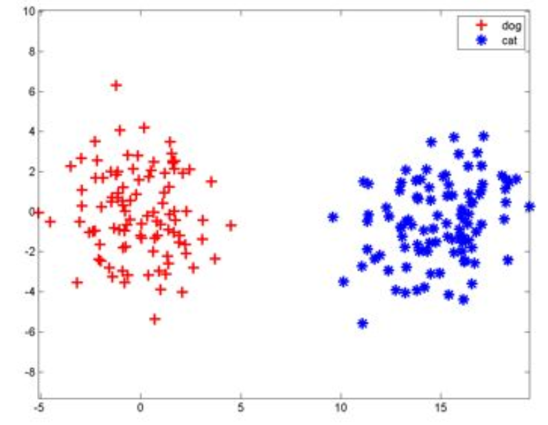
```

但是计算机是不知道如何给一个神经元去分类的，因此是先随机选一个直线或者一个超平面，然后把样本一个一个拿过来，如果这个直线分错了说明这个点分错了，那就把直线稍微移动一点，知道把它分对，换句话说就是神经元一直在“跳舞”，最终跳到可以正确分类的那侧。

## 发展到神经网络

神经元不可微，不好分析，于是引入sigmoid函数变成可导的，于是就有了梯度下降进行训练神经网络了，这就是反向传播算法。

神经元最大的特点就是只能一刀切。但是下图没办法切一刀就分
```{r}
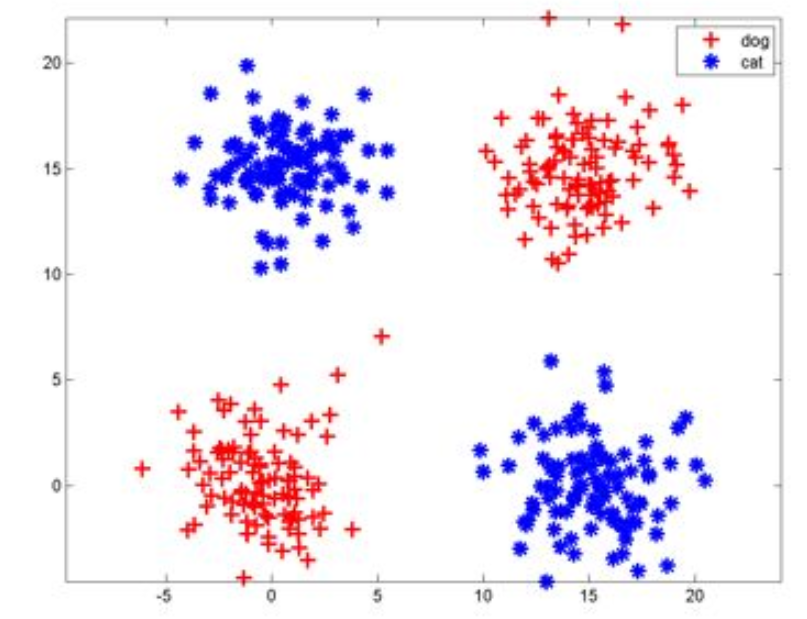
```

于是就有了神经网络，底层神经元的输出是高层神经元的输入，比如可以横一刀，竖一刀，然后合并左上右下。。。与右上左下就分开了，或者。。。

每砍一刀就是一个神经元，把砍下的半平面做交，并处理就是把这些神经元的输入当作下一个神经元的输出，即后面再接一个神经元。**所以说只要足够多的刀，把结果拼在一起，什么奇怪边界的神经网络的结果都能表示**，所以说神经网络就是一个复杂的函数（空间）

但是神经网络能否摆在正确的位置，还要看样本初始值的设置，样本容量和分布。

>神经网络神奇的地方在于它的每一个组件非常简单一把空间切一刀+某种激活函数(0-1阶跃、
sigmoid、max-pooling),但是可以一层一层级联。输入向量连到许多神经元上,这些神经元的输出又连到一-堆神经元上,这一过程可以重复很多次。

这和人脑中的神经元很相似:每一个神经元都有一些神经元作为其输入，又是另一-些神经元的输入,数值向量就像是电信号，在不同神经元之间传导，每一个神经元只有满足了某种条件才会发射信号到下一层神经元。

神经网络主要由：输入层，隐藏层，输出层构成。当隐藏层只有一层时，该网络为两层神经网络，由于输入层未做任何变换，可以不看做单独的一层。**实际中，网络输入层的每个神经元代表了一个特征，输出层个数代表了分类标签的个数（在做二分类时，如果采用sigmoid分类器，输出层的神经元个数为1个；如果采用softmax分类器，输出层神经元个数为2个），而隐藏层层数以及隐藏层神经元是由人工设定**。

**反向传播**

>神经网络的训练依靠反向传播算法:最开始输入层输入特征向量,网络层层计算获得输出，输出层发现输出和正确的类号不一样,这时它就让最后一层神经元进行参数调整，最后一层神经元不仅自己调整参数，还会勒令连接它的倒数第二层神经元调整，层层往回退着调整。经过调整的网络会在样本_上继续测试，如果输出还是老分错，继续来-轮回退调整，直到网络输出满意为止。

*简单一点说就是来回利用梯度下降不断的训练初始化的权重矩阵*，因为我们最终就是要得到这个权重矩阵的。

其实神经网络内部的时间就是再空间里不断的对输入向量做

- 降维/升维
- 放大/缩小
- 旋转
- 平移
- 弯曲

比如这个栗子：
```{r}
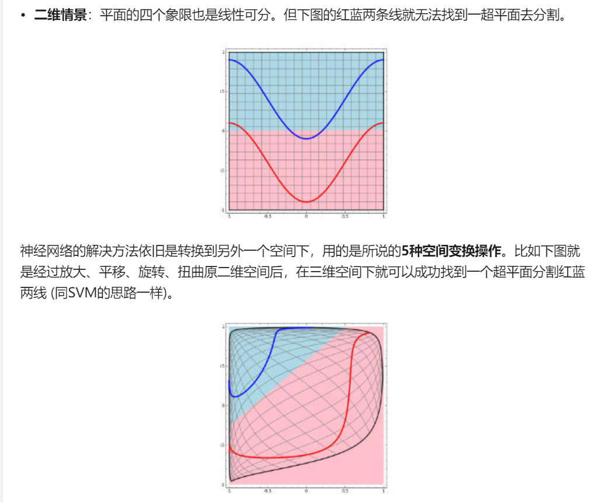
```

**深度学习的三个步骤**

- 找一组合适的函数
- 评价函数好坏
- 择优


## 从简单神经网络谈起

一个二层神经网络的完整结构

输入层：可以简单的理解为输入样本的地方
隐藏层：若是看成黑盒就变成自动调参过程，若不是黑盒可以理解为每个隐藏层就是一个特征代表层，上一个隐藏层的输入就变成了下一个隐藏层的输出。
输出层,以下图[均来自](https://www.cnblogs.com/subconscious/p/5058741.html)

```{r}
knitr::include_graphics("./figs/5.jpg")
```


在训练一个神经网络的时候需要先设置一些值

1. 输入层与输出层的节点数往往是固定的(因此输入的特征变量是固定的)，中间层(隐藏层)则可以根据需要指定；
1. 神经网络结构图中的拓扑与箭头代表着预测过程时数据的流向，跟训练时的数据流有一定的区别；
1. 结构图里的关键不是圆圈(结点)（代表“神经元”），而是**连接线（代表“神经元”之间的连接）**。每个连接线对应一个不同的**权重（其值称为权值/参数）**，训练神经网络的目的就是为了得到这个参数/权重，让这个参数的值调整到最佳。  
简单来说就是每个连接线上是有一个权值的。$w1,w2,w3$就是权重/参数

当预测的target不是一个值而是一个向量的时候，就是在输出层根据需要增加输出单元就好了。

拿一个神经元举个栗子
```{r}
knitr::include_graphics("./figs/8.jpg")
```
因此每一个箭头就是一个输入值的加权传递，这个图里面的sum和sgn可以合并到一起表示一个神经元的内部计算.

当有一个样本输入的时候，有4个特征是已知的，一个特征未知，神经网络是可以根据已知的特征来预测未知的特征(target)。

为了更好的表示各层神经元之间的关系，权值矩阵可以采用下面的方法来表示
比如：$w_{1 2}$代表后一层的第1个神经元与前一层的第2个神经元的连接的权值（这种标记方式参照了Andrew Ng的课件）
```{r}
knitr::include_graphics("./figs/9.jpg")
```

因此换到矩阵的表示

输入的变量是$[a1，a2，a3]^T$（代表由a1，a2，a3组成的列向量），用向量a来表示。方程的左边是$[z1，z2]^T$，用向量z来表示。系数则是矩阵W（2行3列的矩阵，排列形式与公式中的一样）。
于是，输出公式可以改写成:$g(W * a) = z$,这就是单层神经网络从前一层计算后一层的矩阵表示，因此推广到多层的时候就很方便的表示了。
比如两层神经网络
```{r}
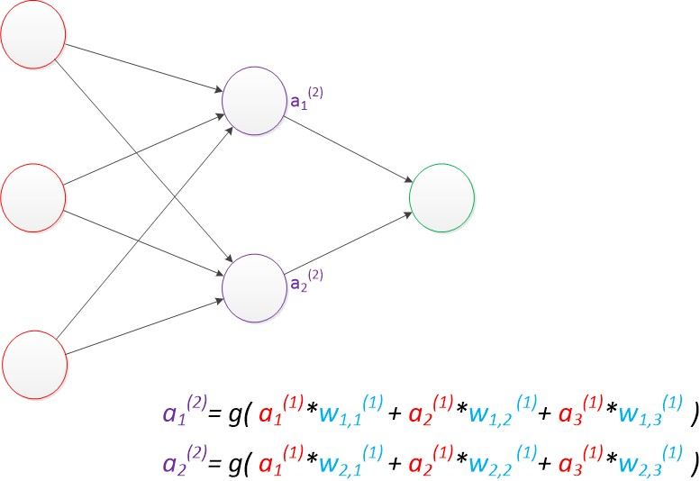
```
```{r}
knitr::include_graphics("./figs/11.jpg")
```

这样就好理解了，无论多少等，都可以表示为矩阵相乘的形式，层层函数g的嵌套形式，也就是由最简单的线性变成了复杂的非线性。这个思想太牛了.

>使用矩阵运算来表达是很简洁的，而且也不会受到节点数增多的影响（无论有多少节点参与运算，乘法两端都只有一个变量）。因此神经网络的教程中大量使用矩阵运算来描述。[@计算机的浅意识]

在神经网络的每个层次中，除了输出层以外，都会含有这样一个偏置单元。正如线性回归模型与逻辑回归模型中的一样。偏置单元与后一层的所有节点都有连接，我们设这些参数值为向量b，称之为偏置。可以理解为一个存储单元。而且存储值永远为1.（额，这里理解不了）

```{r}
knitr::include_graphics("./figs/12.jpg")
```

## 激活函数

>神经网络的本质就是通过参数与激活函数来拟合特征与目标之间的真实函数关系

>之前线性处理之后的输入信号通过激活函数进行非线性变换，从而得到输出信号。即最后输出的信号具有f(a*W1+b)的形式，其中f()为激活函数。

### sigmoid

$$\text { sigmoid }(x)=1 /\left(1+e^{-x}\right)$$
可以把把序列变成0-1之间的数，因为这个函数的值域是(0-1)

```{r}
sigmoid<-function(x){
  sigmoid=1/(1+exp(-x))
}

x <- seq(-5, 5, 0.01)
plot(x,sigmoid(x),col='red')

```

### 线性整流函数(ReLU-Rectified Linear Units)

近来的神经网络倾向于使用ReLU替代掉sigmoid函数作为隐层的激活函数，它的定义如下：

$$f(x) = max(x,0)$$

当x大于0时，函数输出x，其余的情况输出为0。函数的图像是：

使用ReLU函数的好处是，对于所有大于0的输入，梯度是恒定的，这能够加快训练网络的速度。
```{r}
relu<-function(x){
  ifelse(x>0,x,0)
}
x <- seq(0, 10, 0.01)
plot(x,relu(x),col='red')
```

### softmax

softmax 的作用是把 一个序列变成概率。概率就是0-1之间的。神经网络的输出层函数。

$$S(\mathbf{a}):\left[\begin{array}{c}a_{1} \\ a_{2} \\ \dots \\ a_{N}\end{array}\right] \rightarrow\left[\begin{array}{c}S_{1} \\ S_{2} \\ \cdots \\ S_{N}\end{array}\right]$$

作用

所有的值都是 [0, 1] 之间的（因为概率必须是 [0, 1]）
所有的值加起来等于 1

## 到多层神经网络

>预训练”（pre-training）：

>微调”(fine-tuning)技术

这两项技术都可以减少神经网络的训练时间。

增加神经网络的层数，就是把原来的输出层变为中间的隐藏层，根据自己的需要增加，这里可以简单的计算一个输出的z

$g\left(\mathbf{W}(1)^{\star} \mathbf{a}(1)\right)=\mathbf{a}(2)$
$g(W(2) * a(2))=a(3)$
$g(\mathbf{W}(3) * \mathbf{a}(3))=\mathbf{z}$
g就是激活函数

```{r}
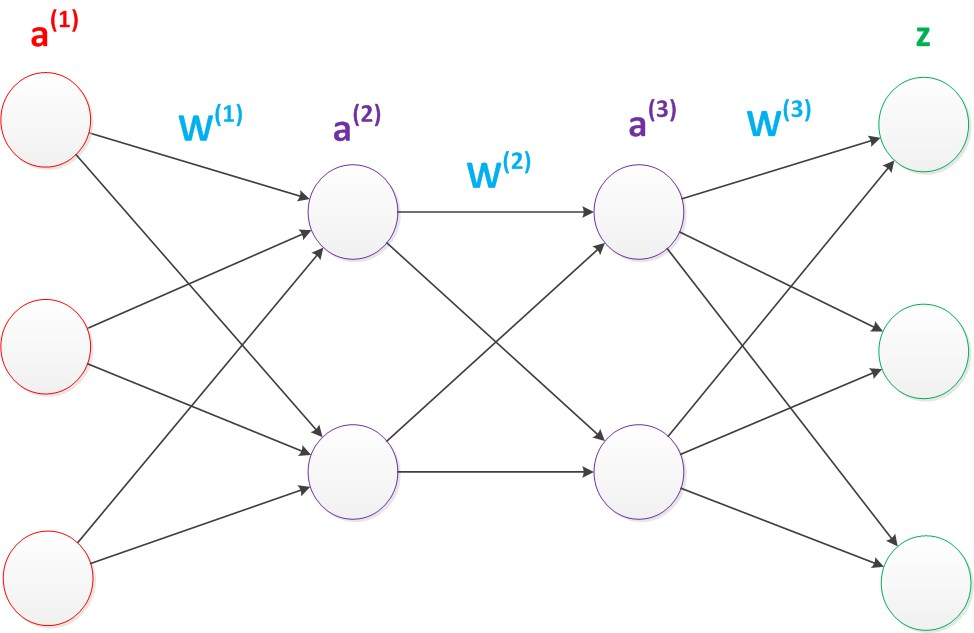
```

>更深入的表示特征可以这样理解，随着网络的层数增加，每一层对于前一层次的抽象表示更深入。在神经网络中，每一层神经元学习到的是前一层神经元值的更抽象的表示。例如第一个隐藏层学习到的是“边缘”的特征，第二个隐藏层学习到的是由“边缘”组成的“形状”的特征，第三个隐藏层学习到的是由“形状”组成的“图案”的特征，最后的隐藏层学习到的是由“图案”组成的“目标”的特征。通过抽取更抽象的特征来对事物进行区分，从而获得更好的区分与分类能力。[计算机浅意识](https://www.cnblogs.com/subconscious/p/5058741.html)

>更强的函数模拟能力是由于随着层数的增加，整个网络的参数就越多。而神经网络其实本质就是模拟特征与目标之间的真实关系函数的方法，更多的参数意味着其模拟的函数可以更加的复杂，可以有更多的容量（capcity）去拟合真正的关系。[计算机浅意识](https://www.cnblogs.com/subconscious/p/5058741.html)

>通过研究发现，在参数数量一样的情况下，更深的网络往往具有比浅层的网络更好的识别效率。这点也在ImageNet的多次大赛中得到了证实。[计算机浅意识](https://www.cnblogs.com/subconscious/p/5058741.html)

```{r}
knitr::include_graphics("./figs/7.jpg")
```


## 概念辨析


lost function== cost function== error function 损失函数/代价函数/残差函数

表示真实值和预测值之间的差的绝对值

>　再来就是权重weight和参数parameter的说法，神经网络界由于以前的惯例，一般会将训练得到的参数称之为权重，而不像其他机器学习方法就称之为参数。这个需要记住就好。不过在目前的使用惯例中，也有这样一种规定。那就是非偏置节点连接上的值称之为权重，而偏置节点上的值称之为偏置，两者统一起来称之为参数。[@计算机的浅意识]

>另外一个同义词就是激活函数active function和转移函数transfer function了。同样，他们代表一个意思，都是叠加的非线性函数的说法。[@计算机的浅意识]

## MLP

MLP一般都指的是两层（带一个隐藏层的）神经网络

最简单的神经网络包括一个输入层、一个隐藏层和一个输出层。每一层都由多个神经元组成，每一层的每个神经元都与下一层中的所有神经元相连。这样的网络可以被称为是全连接网络。

## 学习率

学习速率定义为在每次迭代过程中对成本函数的最小化次数。简单来说，学习速率就是指朝着成本函数最小值的下降速率。选择学习速率需要很谨慎，过大会导致可能越过最优解，过小会导致收敛花费太多的时间。

## 分批(Batches)
当在训练一个神经网络的时候，相对于一次性将所有的数据全输入进去，有一个更好的方法：先将数据随机地分为几个大小一致的数据块，再分批次输入。跟一次性训练出来的模型相比，分批训练能够使模型的适用性更好 。

## 周期(epochs)
一个周期表示对所有的数据批次都进行了一次迭代，包括一次正向传播和一次反向传播，所以一个周期/纪元就意味着对所有的输入数据分别进行一次正向传播和反向传播。

训练网络周期的次数是可以选择的，往往周期数越高，模型的准确性就越高，但是，耗时往往就越长。同样你还需要考虑如果周期/纪元的次数过高，那么可能会出现过拟合的情况。

## Dropout方法
Dropout是一个可以阻止网络过拟合的规则化方法。就像它的名字那样，在训练过程中隐藏的某些特定神经元会被忽略掉(drop)。这意味着网络的训练是在几个不同的结构上完成的。

这种dropout的方式就像是一场合奏，多个不同结构网络的输出组合产生最终的输出结果。

## 多层神经网络

更强的函数模拟能力是由于随着层数的增加，整个网络的参数就越多。而神经网络其实本质就是模拟特征与目标之间的真实关系函数的方法，更多的参数意味着其模拟的函数可以更加的复杂，可以有更多的容量（capcity）去拟合真正的关系。

## CNN

```{r child="rmd/CNN.rmd"}

```
# Attention

Attention机制，将有限的注意力集中在重点信息上，从而节省资源，快速获得最有效的信息。Attention 解决了 RNN 不能并行计算的问题。Attention机制每一步计算不依赖于上一步的计算结果，因此可以和CNN一样并行处理。

>Attention的思想理解起来比较容易，就是在decoding阶段对input中的信息赋予不同权重。在nlp中就是针对sequence的每个time step input，在cv中就是针对每个pixel。

# Transformer 

>Transformer 是Google Brain 2017的提出的一篇工作，它针对RNN的弱点进行重新设计，解决了RNN效率问题和传递中的缺陷等，在很多问题上都超过了RNN的表现。Transfromer的基本结构如下图所示，它是一个N进N出的结构，也就是说每个Transformer单元相当于一层的RNN层，接收一整个句子所有词作为输入，然后为句子中的每个词都做出一个输出。但是与RNN不同的是，Transformer能够同时处理句子中的所有词，并且任意两个词之间的操作距离都是1，这么一来就很好地解决了上面提到的RNN的效率问题和距离问题。

# RNN

循环神经网络

图来自[@zhihu]
```{r}
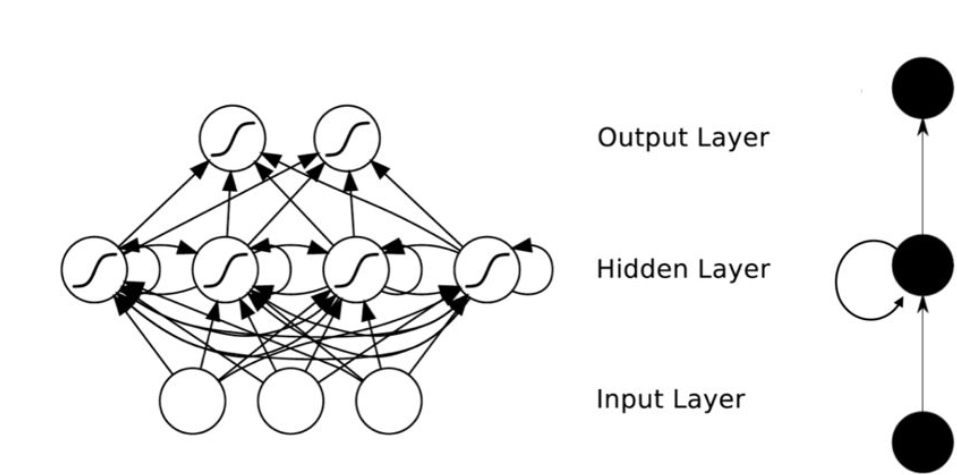
```

可以看出神经元的输出可以下一个时间索引直接作用回到自身，也就是hide层增加了互联

```{r}
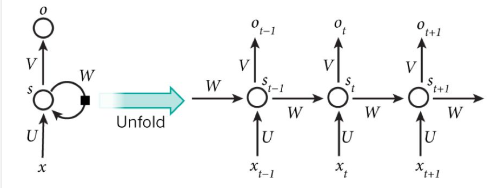
```

可以看出t+1时刻的输出结果$o_{t+1}$是由该时刻的输入和历史的输入共同作用的，换句话说就是很好的吸收了历史信息。[@zhihu]

>是自然语言这样的序列信息，是一个一维的结构，RNN就是专门针对这些序列的结构而设计的，通过各种门的操作，使得序列前后的信息互相影响，从而很好地捕捉序列的特征。[@深度学习笔记]

>RNN可以看成一个**在时间上传递的神经网络**，它的深度是时间的长度!正如我们上面所说，"梯度消失" 现象又要出现了，只不过这次发生在时间轴上。对于t时刻来说，它产生的梯度在时间轴上向历史传播几层之后就消失了，根本就无法影响太遥远的过去。因此，之前说“所有历史”共同作用只是理想的情况，在实际中，这种影响也就只能维持若千个时间戳。因此待优化。

>RNN受到短期记忆的影响。如果序列很长，他们将很难将信息从较早的时间步传送到后面的时间步。因此，如果你尝试处理一段文本进行预测，RNN可能会遗漏开头的重要信息

RNN梯度消失和下降的原因[知乎专栏](https://zhuanlan.zhihu.com/p/28687529)

**序列特征**

所谓序列，指的是一块可存放多个值的连续内存空间，这些值按一定顺序排列，可通过每个值所在位置的编号（称为索引）访问它们。

为了更形象的认识序列，可以将它看做是一家旅店，那么店中的每个房间就如同序列存储数据的一个个内存空间，每个房间所特有的房间号就相当于索引值。也就是说，通过房间号（索引）我们可以找到这家旅店（序列）中的每个房间（内存空间）

再比如时间序列就是一个序列特征

**RNN存在的两个问题**

RNN有两个很明显的问题

- 效率问题：需要逐个词进行处理，后一个词要等到前一个词的隐状态输出以后才能开始处理
- 如果传递距离过长还会有梯度消失、梯度爆炸和遗忘问题为了缓解传递间的梯度和遗忘问题，设计了各种各样的RNNcell，最著名的两个就是LSTM和GRU了.


## RNN的几种形式

1. 输入的序列和输出序列是等长的，这是比较经典的RNN，适用范围比较小。
```{r}
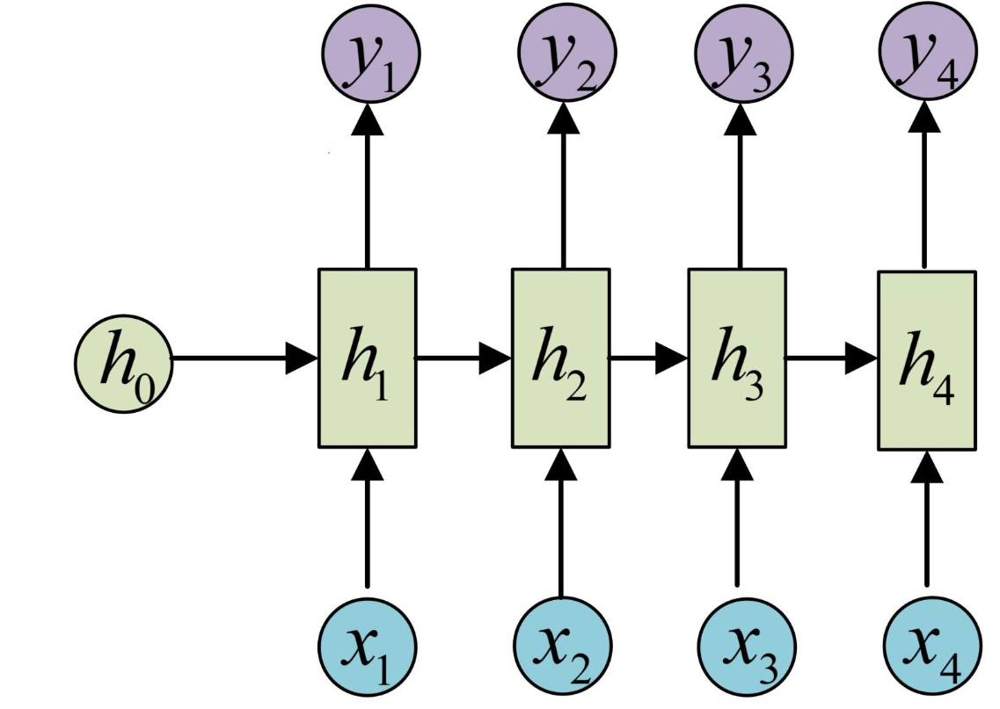
```

1. 输入的是序列，输出的是一个值，也就是在最后一个隐藏层加上一个输出变换就行了。

>
这种结构通常用来处理序列分类问题。如输入一段文字判别它所属的类别，输入一个句子判断其情感倾向，输入一段视频并判断它的类别等等。[@]

```{r}
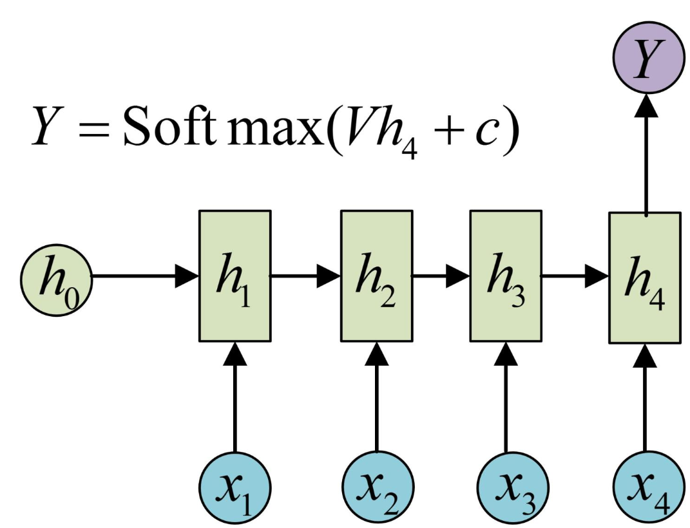
```

1. 输入不是序列而输出为序列

我们可以只在序列开始进行输入计算,或者把x作为每一个阶段的输入

>输入的X就是图像的特征，而输出的y序列就是一段句

```{r}
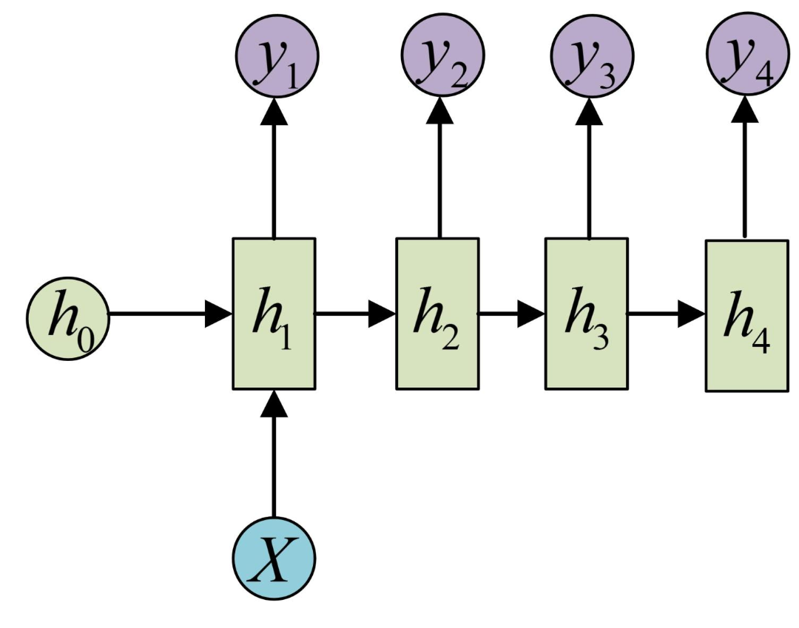
```

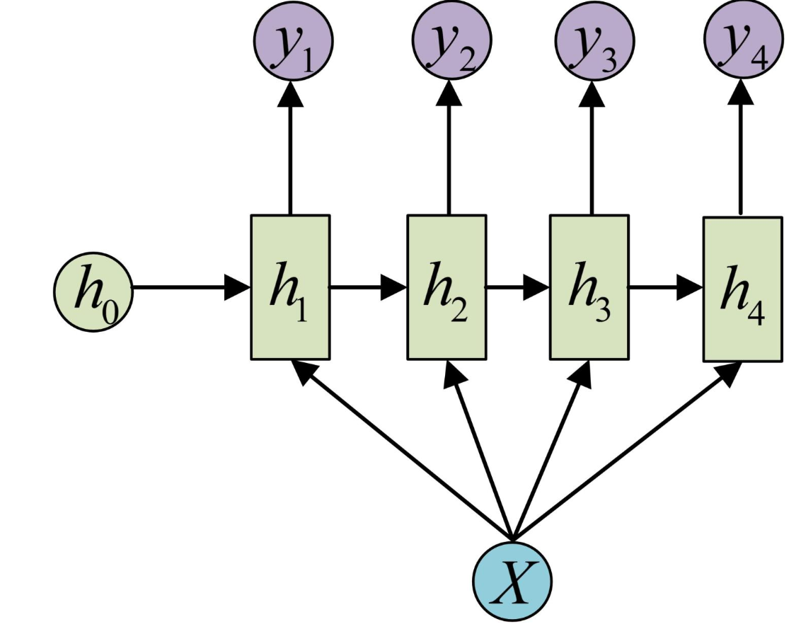


## Encoder-Decoder

编码+解码

>原始的N vs N RNN要求序列等长，然而我们遇到的大部分问题序列都是不等长的，如机器翻译中，源语言和目标语言的句子往往并没有相同的长度。


## 双向循环神经网络

RNN可以利用历史信息，自然也可以利用未来的信息--->双向RNN


# LSTM

长短时记忆循环网络
通过门的开关实现时间上的记忆功能，并防止梯度消失

>长短期记忆（Long short-term memory, LSTM）是一种特殊的RNN，主要是为了解决长序列训练过程中的梯度消失和梯度爆炸问题。简单来说，就是相比普通的RNN，LSTM能够在更长的序列中有更好的表现。通过门控状态来控制传输状态，记住需要长时间记忆的，忘记不重要的信息；而不像普通的RNN那样只能够“呆萌”地仅有一种记忆叠加方式。对很多需要“长期记忆”的任务来说，尤其好用。[@深度学习234]

```{r}
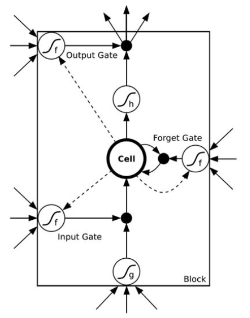
```

来一个更直观的图[@深度学习234]

```{r}
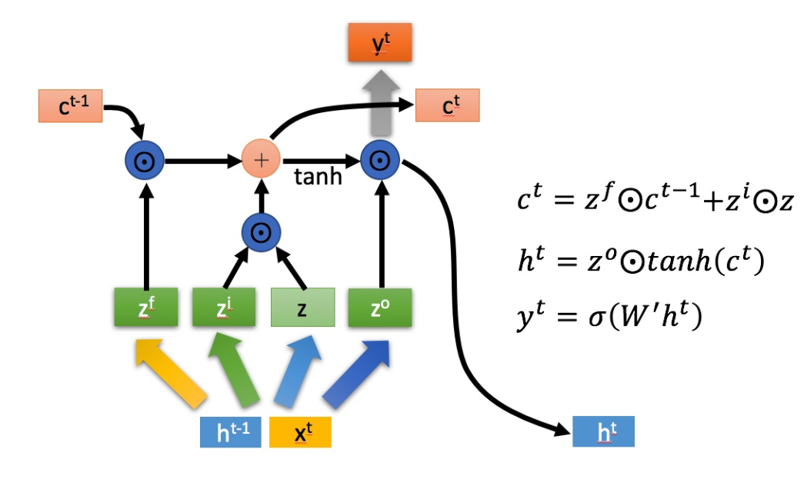
```
```{r}
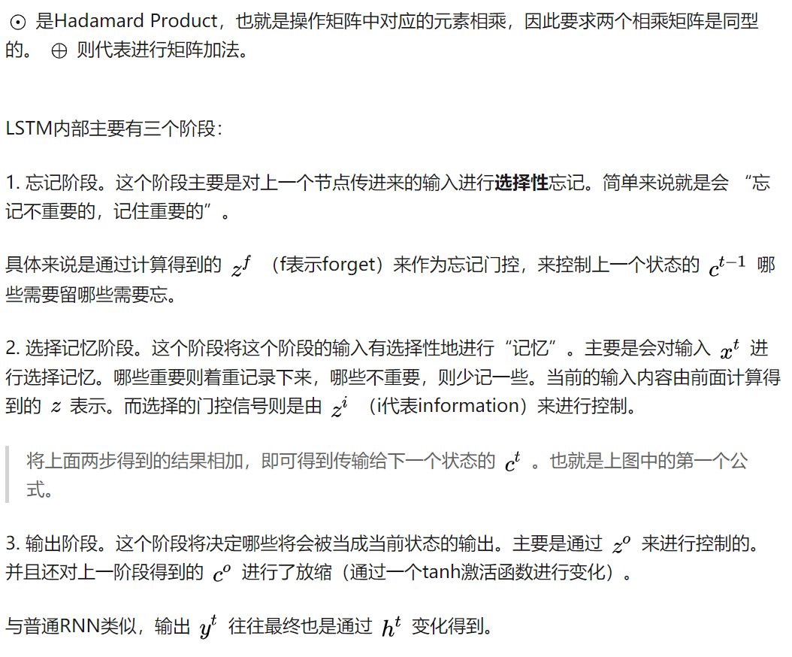
```

>LSTM的核心概念是单元状态（cellstate），它是多种不同的门。单元状态充当传输的高速公路，在序列链中传递相关信息。你可以将其视为**网络的记忆**。理论上，单元状态可以在序列的整个处理过程中携带相关信息。因此，即使来自较早时间步的信息也可用于较晚时间步，从而减少短期记忆的影响。随着单元状态继续进行，信息通过门被添加或移除到单元状态。门是不同的神经网络，用来决定哪些信息可以允许进入单元状态。在训练中，门可以知道哪些信息是需要保存或忘记的。

## 遗忘门

forget gate
决定应丢弃或保留哪些信息。来自先前隐藏状态和来自当前输入的信息通过sigmoid函数传递。值介于0和1之间。越接近0越容易遗忘，越接近1则意味着要保留。

## 传输门

>要更新单元状态，我们需要输入门。首先，我们将先前的隐藏状态和当前输入传递给sigmoid函数。这决定了通过将值转换为0到1来更新哪些值。0表示不重要，1表示重要。你还将隐藏状态和当前输入传递给tanh函数，将它们压缩到-1和1之间以帮助调节网络。然后将tanh输出与sigmoid输出相乘。sigmoid输出将决定哪些信息很重要，需要tanh输出保存。


## 单元状态

>现在我们有足够的信息来计算单元状态。首先，单元状态逐点乘以遗忘向量。如果它乘以接近0的值，则有可能在单元状态中丢弃值。然后我们从输入门获取输出并进行逐点加法，将单元状态更新为神经网络发现相关的新值。这就得到了新的单元状态。

## 输出门

>最后我们有输出门。输出门决定下一个隐藏状态是什么。请记住，隐藏状态包含有关先前输入的信息。隐藏状态也用于预测。首先，我们将先前的隐藏状态和当前输入传递给sigmoid函数。然后我们将新的单元状态传递给tanh函数。将tanh输出与sigmoid输出相乘，以决定隐藏状态应携带的信息。它的输出是隐藏状态。然后将新的单元状态和新的隐藏状态传递到下一个时间步。

**遗忘门决定了哪些内容与前面的时间步相关。输入门决定了从当前时间步添加哪些信息。输出门决定下一个隐藏状态应该是什么**

双向LSTM

# GRU

同LSTM的作用是一样的
只不过只有两个门

## 更新门

更新门的作用类似于LSTM的遗忘和输入门。它决定要丢弃哪些信息和要添加哪些新信息。

## 重置门

重置门是另一个用来决定要忘记多少过去的信息的门。

这就是GRU。GRU的张量操作较少；因此，他们的训练速度要比LSTM快一些。但还说不清哪个更好。研究人员和工程师通常都会尝试，以确定哪一个更适合他们的用例。


```{r child="rmd/GCN.rmd"}

```

# 迁移学习

```{r child="rmd/transfer-learning.rmd"}

```


# 参考文献